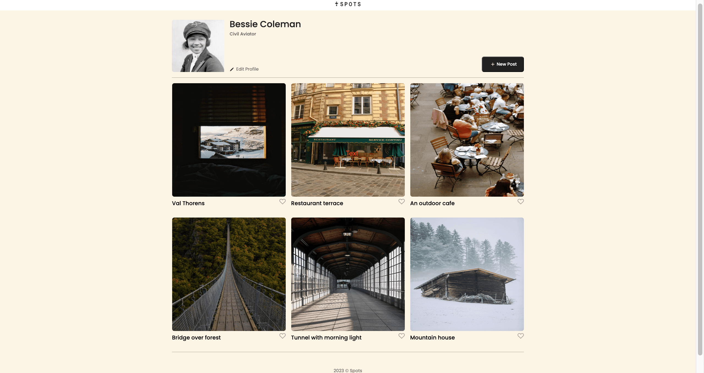

# Project 3: Spots

Spots is a project allowing the student to code a webpage from scratch.  Given a few parameters in which they should abide in, this website gives the student the opportunity to apply HTML and CSS collaboratively.  Furthermore, it features a pagebreak representing the viewpoint of mobile devices for easy scalability. 

### Tech Stack

* HTML
* CSS
* Responsive Design 
  
## Deployment

This webpage is deployed to GitHub pages at the following [link](https://rudy5004.github.io/se_project_spots/)

  
**Images / Video**  

[Video link](https://drive.google.com/file/d/1_BrOlmkNdlYtxPBljZgpRR34xcqu_r8t/view?usp=sharing)
