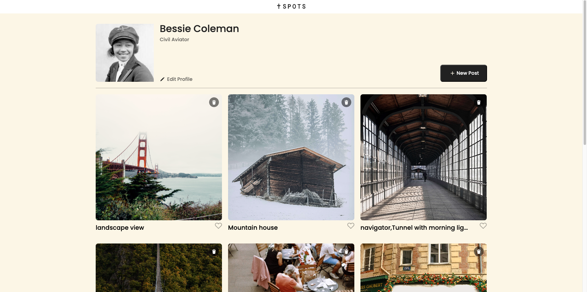
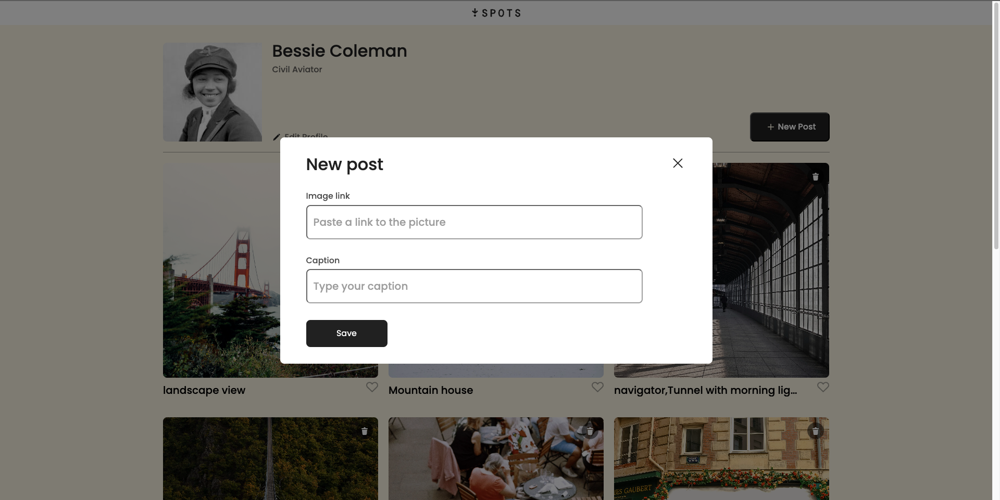

# Project 3: Spots

"Spot" is a comprehensive social media platform designed for seamless user interaction and content sharing. It enables users to upload photos, provide detailed descriptions of images, and engage with content through likes and other interactive features. The platform supports dynamic profile management, allowing users to edit their profiles in real-time. It employs a responsive design architecture, incorporating page breaks to ensure optimal accessibility and usability for desktops, tablets and mobile devices.

### Tech Stack

* DOM
* Figma
* Git
* GitHub
* HTML/CSS
* JavaScript
* Responsive Design
* VSCode

  
## Deployment

This webpage is deployed to GitHub pages at the following [link](https://rudy5004.github.io/se_project_spots/)

  
**Images / Video**  

